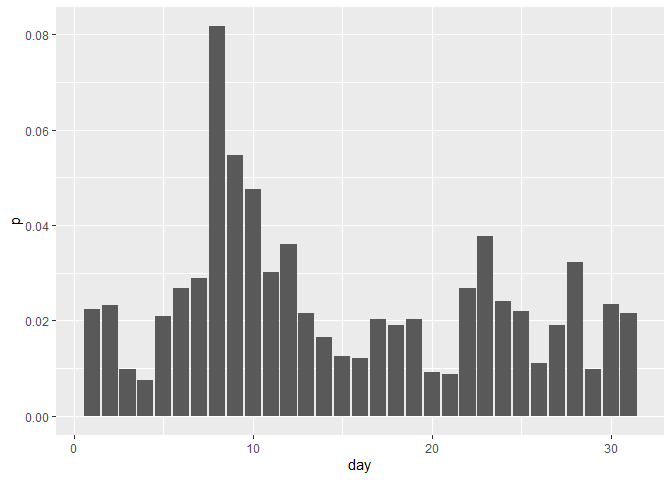
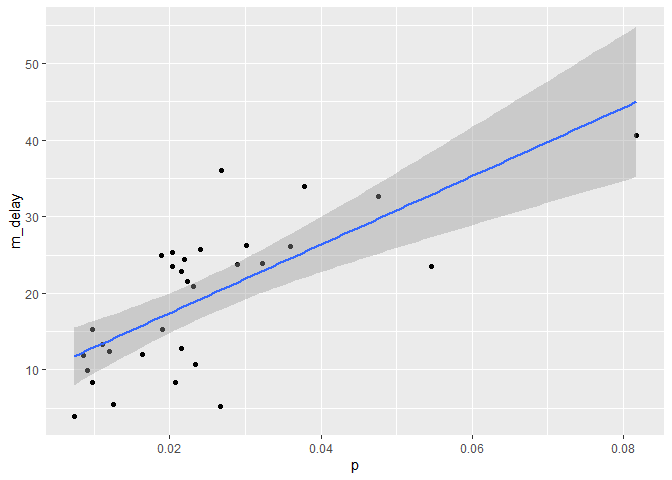

STAT433: Homework 1
================
Doy Kim
September 27, 2022

# Prob 1

How many flights have a missing dep_time? What other variables are
missing? What might these rows represent?

## Missing dep_time

``` r
df = flights

(missing_dep_time = df %>%
  filter(is.na(dep_time) == TRUE) %>%
  summarize(nn = n()))
```

    ## # A tibble: 1 × 1
    ##      nn
    ##   <int>
    ## 1  8255

> 8255 flights have a missing dep_time.

## Other variables with missing values

``` r
colSums(is.na(df))
```

    ##           year          month            day       dep_time sched_dep_time 
    ##              0              0              0           8255              0 
    ##      dep_delay       arr_time sched_arr_time      arr_delay        carrier 
    ##           8255           8713              0           9430              0 
    ##         flight        tailnum         origin           dest       air_time 
    ##              0           2512              0              0           9430 
    ##       distance           hour         minute      time_hour 
    ##              0              0              0              0

> Beside `dep_time`, the following variables contain missing values:
> `dep_dely`, `arr_time`, `arr_delay`, `tailnum`, `air_time`

## Interpretation

``` r
df.missing = df %>%
  filter(is.na(dep_time) == TRUE,
         is.na(dep_delay) == TRUE,
         is.na(arr_time) == TRUE,
         is.na(arr_delay) == TRUE,
         is.na(air_time) == TRUE)

head(df.missing, 10)
```

    ## # A tibble: 10 × 19
    ##     year month   day dep_time sched_de…¹ dep_d…² arr_t…³ sched…⁴ arr_d…⁵ carrier
    ##    <int> <int> <int>    <int>      <int>   <dbl>   <int>   <int>   <dbl> <chr>  
    ##  1  2013     1     1       NA       1630      NA      NA    1815      NA EV     
    ##  2  2013     1     1       NA       1935      NA      NA    2240      NA AA     
    ##  3  2013     1     1       NA       1500      NA      NA    1825      NA AA     
    ##  4  2013     1     1       NA        600      NA      NA     901      NA B6     
    ##  5  2013     1     2       NA       1540      NA      NA    1747      NA EV     
    ##  6  2013     1     2       NA       1620      NA      NA    1746      NA EV     
    ##  7  2013     1     2       NA       1355      NA      NA    1459      NA EV     
    ##  8  2013     1     2       NA       1420      NA      NA    1644      NA EV     
    ##  9  2013     1     2       NA       1321      NA      NA    1536      NA EV     
    ## 10  2013     1     2       NA       1545      NA      NA    1910      NA AA     
    ## # … with 9 more variables: flight <int>, tailnum <chr>, origin <chr>,
    ## #   dest <chr>, air_time <dbl>, distance <dbl>, hour <dbl>, minute <dbl>,
    ## #   time_hour <dttm>, and abbreviated variable names ¹​sched_dep_time,
    ## #   ²​dep_delay, ³​arr_time, ⁴​sched_arr_time, ⁵​arr_delay
    ## # ℹ Use `colnames()` to see all variable names

> Note that I ignored missing values in `tailnum` since it is an
> aircraft identifier, not a characteristic of a specific flight. Having
> simultaneous missing values in `dep_time`, `dep_delay`, `arr_time`,
> `arr_delay`, and `air_time` is likely to mean that the filghts were
> scheduled, but ended up not taking place.

# Prob 2

Currently `dep_time` and `sched_dep_time` are convenient to look at, but
hard to compute with because they’re not really continuous numbers.
Convert them to a more convenient representation of number of minutes
since midnight.

``` r
df_new_time = df %>%
  select(dep_time, sched_dep_time, hour) %>%
  mutate(dep_hour = floor(dep_time/100),
         new_dep_time = dep_hour*60 + (dep_time - dep_hour*100),
         sched_hour = hour,
         new_sched_time = sched_hour*60 + (sched_dep_time - sched_hour*100)) %>%
  select(dep_time, new_dep_time, sched_dep_time, new_sched_time)

head(df_new_time, 10)
```

    ## # A tibble: 10 × 4
    ##    dep_time new_dep_time sched_dep_time new_sched_time
    ##       <int>        <dbl>          <int>          <dbl>
    ##  1      517          317            515            315
    ##  2      533          333            529            329
    ##  3      542          342            540            340
    ##  4      544          344            545            345
    ##  5      554          354            600            360
    ##  6      554          354            558            358
    ##  7      555          355            600            360
    ##  8      557          357            600            360
    ##  9      557          357            600            360
    ## 10      558          358            600            360

# Prob 3

Look at the number of canceled flights per day. Is there a pattern? Is
the proportion of canceled flights related to the average delay? Use
multiple dyplr operations, all on one line, concluding with
ggplot(aes(x= ,y=)) + geom_point()

## Is there a pattern?

``` r
# canceled
(
  df.canceled = df %>% 
  group_by(day) %>% 
  summarize(canceled = sum(is.na(dep_time) == TRUE),
            total = n(),
            p = canceled/total,
            m_delay = mean(dep_delay + arr_delay, na.rm = TRUE))
 )
```

    ## # A tibble: 31 × 5
    ##      day canceled total       p m_delay
    ##    <int>    <int> <int>   <dbl>   <dbl>
    ##  1     1      246 11036 0.0223    21.5 
    ##  2     2      250 10808 0.0231    20.9 
    ##  3     3      109 11211 0.00972   15.2 
    ##  4     4       82 11059 0.00741    3.98
    ##  5     5      226 10858 0.0208     8.29
    ##  6     6      296 11059 0.0268     5.21
    ##  7     7      318 10985 0.0289    23.7 
    ##  8     8      921 11271 0.0817    40.7 
    ##  9     9      593 10857 0.0546    23.5 
    ## 10    10      535 11227 0.0477    32.7 
    ## # … with 21 more rows
    ## # ℹ Use `print(n = ...)` to see more rows

``` r
# Graph
df.canceled %>%
  ggplot(aes(x = day, y = p)) +
  geom_bar(stat = "identity")
```

<!-- -->

``` r
# Pattern? Random?
df.chi = df.canceled %>%
  mutate(non_canceled = total - canceled) %>%
  select(canceled, non_canceled)

chisq.test(df.chi)
```

    ## 
    ##  Pearson's Chi-squared test
    ## 
    ## data:  df.chi
    ## X-squared = 3275.2, df = 30, p-value < 2.2e-16

> The bar graph indicates that around filght cancellation is the most
> frequent aroung the 10th of a month. The chi-squared test’s result
> also suggest that the cancellation pattern across different days is
> not random. However, a more thorough investigation is required to
> specify the characteristics of the pattern.

## Is the proportion of canceled flights related to the average delay?

``` r
lm_out = lm(data = df.canceled, m_delay ~ p)
summary(lm_out)
```

    ## 
    ## Call:
    ## lm(formula = m_delay ~ p, data = df.canceled)
    ## 
    ## Residuals:
    ##      Min       1Q   Median       3Q      Max 
    ## -15.2201  -4.4249   0.9683   4.5084  15.5679 
    ## 
    ## Coefficients:
    ##             Estimate Std. Error t value Pr(>|t|)    
    ## (Intercept)    8.461      2.323   3.643  0.00104 ** 
    ## p            447.334     80.945   5.526 5.88e-06 ***
    ## ---
    ## Signif. codes:  0 '***' 0.001 '**' 0.01 '*' 0.05 '.' 0.1 ' ' 1
    ## 
    ## Residual standard error: 6.796 on 29 degrees of freedom
    ## Multiple R-squared:  0.5129, Adjusted R-squared:  0.4961 
    ## F-statistic: 30.54 on 1 and 29 DF,  p-value: 5.881e-06

``` r
df.canceled %>%
  ggplot(aes(x = p, y = m_delay)) +
  geom_point() +
  geom_smooth(method = "lm")
```

    ## `geom_smooth()` using formula 'y ~ x'

<!-- -->

> The regression results and the graph suggest that the average delay in
> a day (`m_delay`) and the proportion of canceled flights in a day
> (`p`) are significantly associated.
